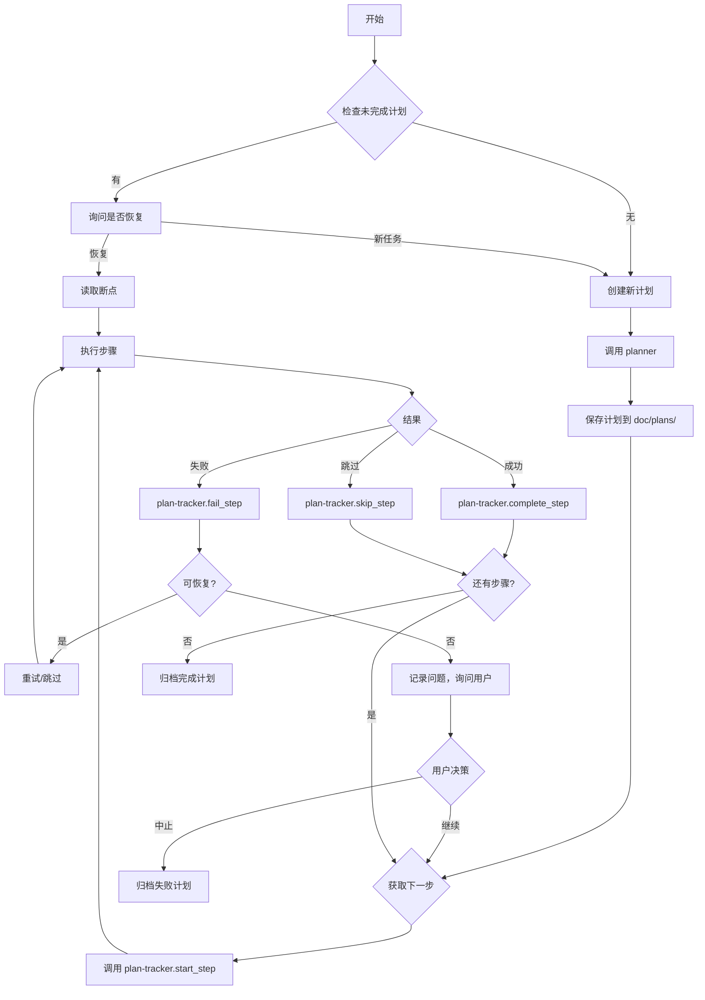

# 编排命令

复杂任务的顺序agent工作流，支持计划持久化、进度追踪和中断恢复。

## 用法

`/orchestrate [工作流类型] [任务描述]`

## 工作流类型

### feature（功能）
完整功能实现工作流：
```
planner -> tdd-guide -> code-reviewer -> security-reviewer
```

### bugfix（修复）
Bug调查和修复工作流：
```
planner -> tdd-guide -> code-reviewer
```

### refactor（重构）
安全重构工作流：
```
architect -> code-reviewer -> tdd-guide
```

### security（安全）
安全聚焦审查：
```
security-reviewer -> code-reviewer -> architect
```

---

## 🔄 进度追踪模式

编排命令会自动追踪执行进度，支持中断恢复。

### 追踪流程



### 执行粒度控制

**关键原则**：主 agent 控制执行粒度，逐个步骤分配任务。

```markdown
## 错误做法 ❌
一次调用 tdd-guide 执行所有实现步骤：
call tdd-guide("实现所有API：注册、登录、登出")

## 正确做法 ✅
逐个步骤调用，每步追踪：
1. plan-tracker.get_next_step() → 步骤 2.1
2. plan-tracker.start_step(2.1)
3. call tdd-guide("实现注册API")  // 单个步骤
4. plan-tracker.complete_step(2.1) 或 fail_step(2.1)
5. 重复...
```

---

## 🔴🟢🔵 TDD 工作流执行规范

### 核心原则

**主 agent 绝不直接编写代码！所有实现必须通过 tdd-guide agent 完成。**

### 为什么必须使用 tdd-guide？

| 角色 | 职责 | 说明 |
|------|------|------|
| **orchestrate (主 agent)** | 协调、追踪、不实现 | 只负责调用其他 agent 和更新进度 |
| **tdd-guide** | 实现、测试、重构 | 执行完整的红-绿-重构循环 |

### 错误示例 ❌

```markdown
## 主 agent 自己写代码（严重错误）

步骤 2.1：实现 Database 类
- 我直接创建 src/Database.php
- 我直接创建 tests/DatabaseTest.php  
- 我自己运行测试
- 结果：跳过了 tdd-guide，违背工作流
```

### 正确示例 ✅

```markdown
## 每个实现步骤必须调用 tdd-guide

步骤 2.1：实现 Database 类
1. 更新计划状态为 in_progress
2. 调用 tdd-guide：
   task(
     subagent: "tdd-guide",
     prompt: "TDD 实现 Database 类：
       - 先写测试（DatabaseTest.php）
       - 测试应该失败（红）
       - 实现代码（Database.php）
       - 测试应该通过（绿）
       - 重构优化"
   )
3. tdd-guide 执行完整的红-绿-重构循环
4. 更新计划状态为 completed
```

### TDD 周期强制要求

每个实现步骤必须经过以下验证：

```
🔴 红阶段验证：
   - tdd-guide 必须先创建测试文件
   - 运行测试确认失败
   - 输出 "测试失败（预期）" 

🟢 绿阶段验证：
   - tdd-guide 创建实现文件
   - 运行测试确认通过
   - 输出 "测试通过"

🔵 重构阶段（可选）：
   - 优化代码结构
   - 确保测试仍然通过
```

### 工作流检查清单

执行 feature 工作流时，主 agent 必须自检：

- [ ] 规划阶段：只调用 planner，不写代码
- [ ] 实现阶段：每个步骤都调用 tdd-guide
- [ ] 实现阶段：没有自己创建任何 .php 文件
- [ ] 实现阶段：没有自己运行任何测试命令
- [ ] 审查阶段：调用 code-reviewer 和 security-reviewer

### 违规判定

如果出现以下情况，视为违反工作流：

| 违规行为 | 判定 |
|----------|------|
| 主 agent 直接创建源代码文件 | ❌ 严重违规 |
| 主 agent 直接创建测试文件 | ❌ 严重违规 |
| 主 agent 跳过 tdd-guide | ❌ 严重违规 |
| tdd-guide 没有执行红阶段 | ⚠️ 警告 |
| tdd-guide 没有验证测试失败 | ⚠️ 警告 |

---

## 📋 计划文件位置

| 文件类型 | 路径 |
|----------|------|
| 活跃计划 | `doc/plans/active/YYYY-MM-DD-feature-name.md` |
| 完成计划 | `doc/plans/completed/YYYY-MM-DD-feature-name.md` |
| 需求文档 | `doc/requirements/YYYY-MM-DD-feature-name.md` |

---

## 🔄 恢复机制

### 自动检测中断

启动时自动检查 `doc/plans/active/` 目录：

```markdown
检测到未完成的计划：
- 2026-02-27-user-auth (进行中，30% 完成)
  断点：步骤 2.1 实现注册API
  
是否恢复此计划？
1. 恢复执行
2. 查看详情
3. 开始新任务
```

### 恢复流程

1. 读取计划文件，获取当前状态
2. 识别断点位置（`in_progress` 状态的步骤）
3. 检查依赖关系是否仍有效
4. 从断点继续执行

---

## 执行模式

### 阶段式执行

```markdown
## 阶段1：规划
1. 调用 planner agent 生成计划
2. 调用 plan-tracker.create_plan() 保存计划
3. 计划包含多个阶段和步骤

## 阶段2：实现（逐步骤）
loop 每个步骤:
  1. plan-tracker.get_next_step()
  2. plan-tracker.start_step()
  3. 调用对应 agent 执行单步
  4. 根据结果更新状态
  5. 处理失败情况
end

## 阶段3：审查
1. 调用 code-reviewer
2. 调用 security-reviewer（如需要）
3. 更新最终状态

## 阶段4：完成
1. plan-tracker.complete_plan()
2. 生成最终报告
```

### 失败处理

| 失败类型 | 处理策略 |
|----------|----------|
| **网络/临时错误** | 自动重试，最多3次 |
| **依赖缺失** | 记录问题，标记为 blocked |
| **逻辑/设计错误** | 询问用户：修复/跳过/中止 |
| **不可恢复错误** | 归档失败计划，记录错误详情 |

---

## 交接文档格式

agent之间创建交接文档：

```markdown
## 交接：[前一个agent] -> [下一个agent]

### 上下文
[已做工作的摘要]

### 发现
[关键发现或决策]

### 修改的文件
[涉及的文件列表]

### 未解决问题
[需要下一个agent解决的未决项]

### 建议
[建议的后续步骤]
```

---

## 示例：功能工作流（含追踪）

```
/orchestrate feature "添加用户认证"
```

执行：

```
📋 步骤1：规划
────────────────
调用 planner...
生成计划：用户认证系统
创建计划文件：doc/plans/active/2026-02-27-user-auth.md

📊 计划概览
────────────────
阶段1：数据库层 (3 步骤)
阶段2：API层 (3 步骤)
阶段3：前端层 (2 步骤)
总计：8 步骤，预计 6 小时

🔄 步骤1.1：创建 users 表
────────────────
状态：进行中...
调用 tdd-guide...
结果：✅ 完成
更新进度：1/8 (12%)

🔄 步骤1.2：创建 sessions 表
────────────────
状态：进行中...
调用 tdd-guide...
结果：✅ 完成
更新进度：2/8 (25%)

🔄 步骤2.1：实现注册API
────────────────
状态：进行中...
调用 tdd-guide...
结果：❌ 失败 - 数据库连接超时
重试 1/3...
结果：✅ 完成
更新进度：3/8 (37%)

...

🚨 中断检测
────────────────
步骤 2.2 进行中时中断
保存状态：断点为步骤 2.2
计划文件已更新

---

恢复执行：
/orchestrate resume

📋 恢复计划：2026-02-27-user-auth
────────────────
断点：步骤 2.2 实现登录API
已恢复执行...
```

---

## 最终报告格式

```
编排报告
====================
工作流：feature
任务：添加用户认证
计划ID：2026-02-27-user-auth
Agent：planner -> tdd-guide -> code-reviewer -> security-reviewer

执行统计
-------
总步骤：8
完成：8
跳过：0
失败后重试成功：1
总耗时：5小时32分钟

进度追踪
-------
计划文件：doc/plans/completed/2026-02-27-user-auth.md
需求文档：doc/requirements/2026-02-27-user-auth.md

摘要
-------
[一段话摘要]

Agent输出
-------------
规划：[摘要]
TDD引导：[摘要]
代码审查：[摘要]
安全审查：[摘要]

变更文件
-------------
[所有修改的文件列表]

测试结果
------------
[测试通过/失败摘要]

安全状态
---------------
[安全发现]

建议
--------------
[可发布 / 需要工作 / 阻塞]
```

---

## 并行执行

对于独立检查，并行运行agent：

```markdown
### 并行阶段
同时运行：
- code-reviewer（质量）
- security-reviewer（安全）
- architect（设计）

注意：并行阶段也需要追踪，每个 agent 完成后更新对应步骤状态

### 合并结果
将输出合并到单一报告
```

---

## 参数

$ARGUMENTS:
- `feature <描述>` - 完整功能工作流
- `bugfix <描述>` - Bug修复工作流
- `refactor <描述>` - 重构工作流
- `security <描述>` - 安全审查工作流
- `custom <agents> <描述>` - 自定义agent序列
- `resume [plan_id]` - 恢复中断的计划
- `status [plan_id]` - 查看计划状态
- `list` - 列出所有计划

---

## 自定义工作流示例

```
/orchestrate custom "architect,tdd-guide,code-reviewer" "重新设计缓存层"
```

---

## 与 plan-tracker 的协作

| 编排操作 | plan-tracker 方法 |
|----------|-------------------|
| 保存规划结果 | `create_plan()` |
| 获取待执行步骤 | `get_next_step()` |
| 标记步骤开始 | `start_step()` |
| 标记步骤完成 | `complete_step()` |
| 标记步骤失败 | `fail_step()` |
| 跳过步骤 | `skip_step()` |
| 获取进度 | `get_progress()` |
| 恢复中断 | `resume_plan()` |
| 完成归档 | `complete_plan()` |

---

## 提示

1. 复杂功能**从planner开始**
2. 合并前**始终包含code-reviewer**
3. 对于认证/支付/PII**使用security-reviewer**
4. **保持交接简洁** - 专注于下一个agent需要的内容
5. 如需要，在agent之间**运行验证**
6. **逐步骤执行** - 不要一次分配多个步骤
7. **每次操作后更新进度** - 确保可恢复
8. **失败时记录详情** - 便于排查和恢复
